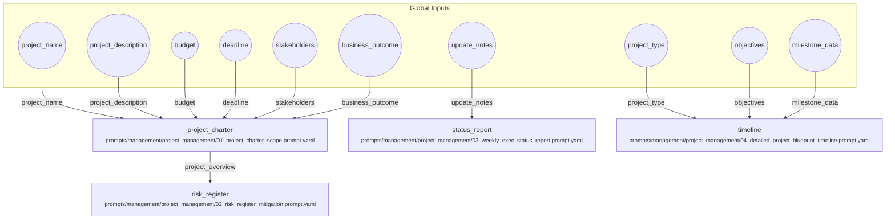

# Project Management Workflow

A workflow to create a project charter, risk register, status report, and timeline.

## Visual Flow

```mermaid
flowchart TD
    subgraph Inputs [Global Inputs]
        inp_project_name((project_name))
        inp_project_description((project_description))
        inp_budget((budget))
        inp_deadline((deadline))
        inp_stakeholders((stakeholders))
        inp_business_outcome((business_outcome))
        inp_update_notes((update_notes))
        inp_project_type((project_type))
        inp_objectives((objectives))
        inp_milestone_data((milestone_data))
    end
    project_charter["project_charter<br/><small>prompts/management/project_management/01_project_charter_scope.prompt.yaml</small>"]
    risk_register["risk_register<br/><small>prompts/management/project_management/02_risk_register_mitigation.prompt.yaml</small>"]
    status_report["status_report<br/><small>prompts/management/project_management/03_weekly_exec_status_report.prompt.yaml</small>"]
    timeline["timeline<br/><small>prompts/management/project_management/04_detailed_project_blueprint_timeline.prompt.yaml</small>"]
    inp_project_name -->|project_name| project_charter
    inp_project_description -->|project_description| project_charter
    inp_budget -->|budget| project_charter
    inp_deadline -->|deadline| project_charter
    inp_stakeholders -->|stakeholders| project_charter
    inp_business_outcome -->|business_outcome| project_charter
    project_charter -->|project_overview| risk_register
    inp_update_notes -->|update_notes| status_report
    inp_project_type -->|project_type| timeline
    inp_objectives -->|objectives| timeline
    inp_milestone_data -->|milestone_data| timeline
```
