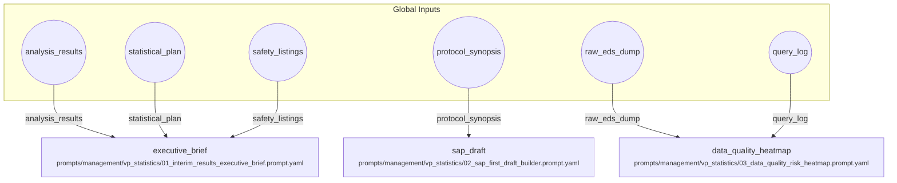

# VP Statistics Workflow

A workflow for creating an interim results executive brief, a statistical analysis plan, and a data quality risk heat map.

## Visual Flow

```mermaid
flowchart TD
    subgraph Inputs [Global Inputs]
        inp_analysis_results((analysis_results))
        inp_statistical_plan((statistical_plan))
        inp_safety_listings((safety_listings))
        inp_protocol_synopsis((protocol_synopsis))
        inp_raw_eds_dump((raw_eds_dump))
        inp_query_log((query_log))
    end
    executive_brief["executive_brief<br/><small>prompts/management/vp_statistics/01_interim_results_executive_brief.prompt.yaml</small>"]
    sap_draft["sap_draft<br/><small>prompts/management/vp_statistics/02_sap_first_draft_builder.prompt.yaml</small>"]
    data_quality_heatmap["data_quality_heatmap<br/><small>prompts/management/vp_statistics/03_data_quality_risk_heatmap.prompt.yaml</small>"]
    inp_analysis_results -->|analysis_results| executive_brief
    inp_statistical_plan -->|statistical_plan| executive_brief
    inp_safety_listings -->|safety_listings| executive_brief
    inp_protocol_synopsis -->|protocol_synopsis| sap_draft
    inp_raw_eds_dump -->|raw_eds_dump| data_quality_heatmap
    inp_query_log -->|query_log| data_quality_heatmap
```
