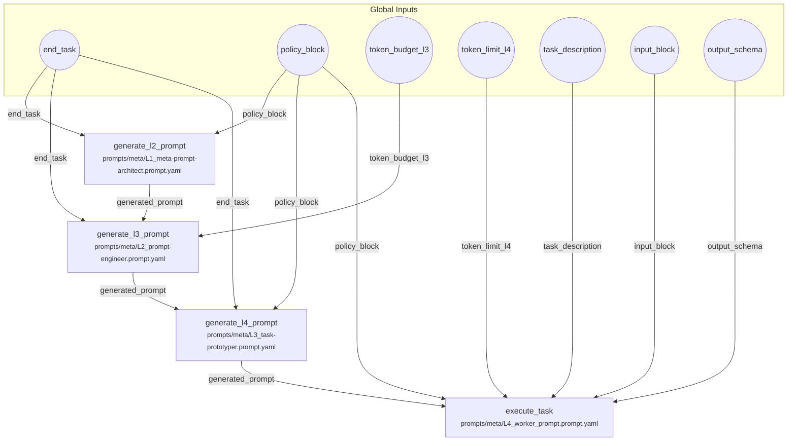

# Meta-Prompt Chain: L1 -> L2 -> L3 -> L4

A workflow that implements the full meta-prompt generative chain.

## Visual Flow

```mermaid
flowchart TD
    subgraph Inputs [Global Inputs]
        inp_end_task((end_task))
        inp_policy_block((policy_block))
        inp_token_budget_l3((token_budget_l3))
        inp_token_limit_l4((token_limit_l4))
        inp_task_description((task_description))
        inp_input_block((input_block))
        inp_output_schema((output_schema))
    end
    generate_l2_prompt["generate_l2_prompt<br/><small>prompts/meta/L1_meta-prompt-architect.prompt.yaml</small>"]
    generate_l3_prompt["generate_l3_prompt<br/><small>prompts/meta/L2_prompt-engineer.prompt.yaml</small>"]
    generate_l4_prompt["generate_l4_prompt<br/><small>prompts/meta/L3_task-prototyper.prompt.yaml</small>"]
    execute_task["execute_task<br/><small>prompts/meta/L4_worker_prompt.prompt.yaml</small>"]
    inp_end_task -->|end_task| generate_l2_prompt
    inp_policy_block -->|policy_block| generate_l2_prompt
    generate_l2_prompt -->|generated_prompt| generate_l3_prompt
    inp_end_task -->|end_task| generate_l3_prompt
    inp_token_budget_l3 -->|token_budget_l3| generate_l3_prompt
    generate_l3_prompt -->|generated_prompt| generate_l4_prompt
    inp_end_task -->|end_task| generate_l4_prompt
    inp_policy_block -->|policy_block| generate_l4_prompt
    generate_l4_prompt -->|generated_prompt| execute_task
    inp_task_description -->|task_description| execute_task
    inp_input_block -->|input_block| execute_task
    inp_output_schema -->|output_schema| execute_task
    inp_policy_block -->|policy_block| execute_task
    inp_token_limit_l4 -->|token_limit_l4| execute_task
```
