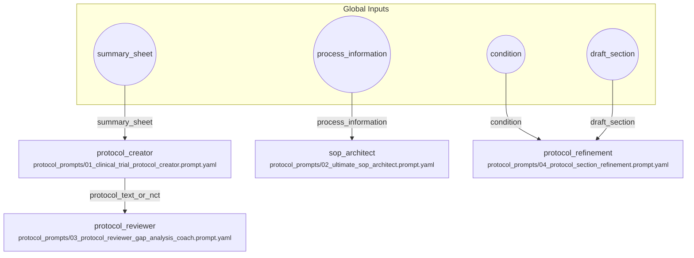

# Protocol Workflow

A workflow to create, review, and refine a clinical trial protocol.

## Visual Flow

```mermaid
flowchart TD
    subgraph Inputs [Global Inputs]
        inp_summary_sheet((summary_sheet))
        inp_process_information((process_information))
        inp_condition((condition))
        inp_draft_section((draft_section))
    end
    protocol_creator["protocol_creator<br/><small>protocol_prompts/01_clinical_trial_protocol_creator.prompt.yaml</small>"]
    sop_architect["sop_architect<br/><small>protocol_prompts/02_ultimate_sop_architect.prompt.yaml</small>"]
    protocol_reviewer["protocol_reviewer<br/><small>protocol_prompts/03_protocol_reviewer_gap_analysis_coach.prompt.yaml</small>"]
    protocol_refinement["protocol_refinement<br/><small>protocol_prompts/04_protocol_section_refinement.prompt.yaml</small>"]
    inp_summary_sheet -->|summary_sheet| protocol_creator
    inp_process_information -->|process_information| sop_architect
    protocol_creator -->|protocol_text_or_nct| protocol_reviewer
    inp_condition -->|condition| protocol_refinement
    inp_draft_section -->|draft_section| protocol_refinement
```
