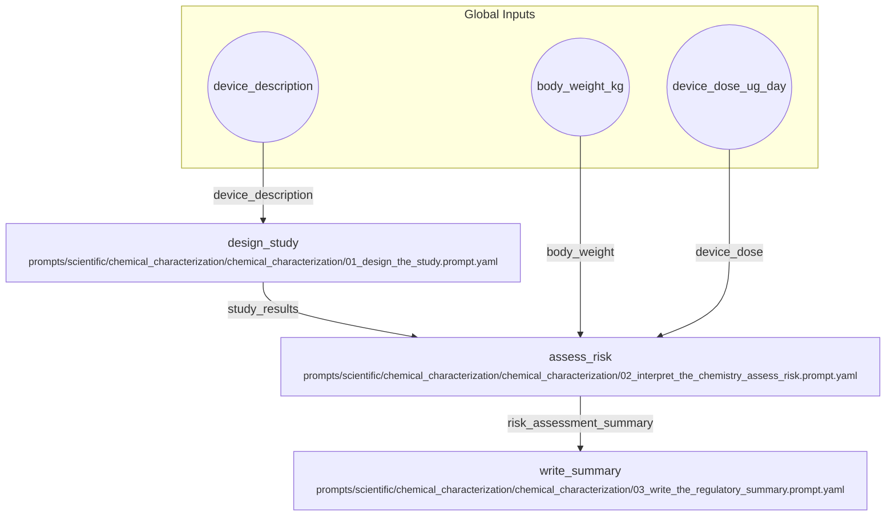

# Chemical Characterization and Biocompatibility Assessment

A workflow to design a chemical characterization study, assess the risks from the results, and write a regulatory summary. This follows the sequence in the chemical_characterization_prompts directory.

## Visual Flow

