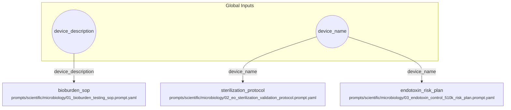

# Microbiology Workflow

A workflow for creating a bioburden testing SOP, an EO sterilization validation protocol, and an endotoxin control risk plan.

## Visual Flow

```mermaid
flowchart TD
    subgraph Inputs [Global Inputs]
        inp_device_description((device_description))
        inp_device_name((device_name))
    end
    bioburden_sop["bioburden_sop<br/><small>prompts/scientific/microbiology/01_bioburden_testing_sop.prompt.yaml</small>"]
    sterilization_protocol["sterilization_protocol<br/><small>prompts/scientific/microbiology/02_eo_sterilization_validation_protocol.prompt.yaml</small>"]
    endotoxin_risk_plan["endotoxin_risk_plan<br/><small>prompts/scientific/microbiology/03_endotoxin_control_510k_risk_plan.prompt.yaml</small>"]
    inp_device_description -->|device_description| bioburden_sop
    inp_device_name -->|device_name| sterilization_protocol
    inp_device_name -->|device_name| endotoxin_risk_plan
```
