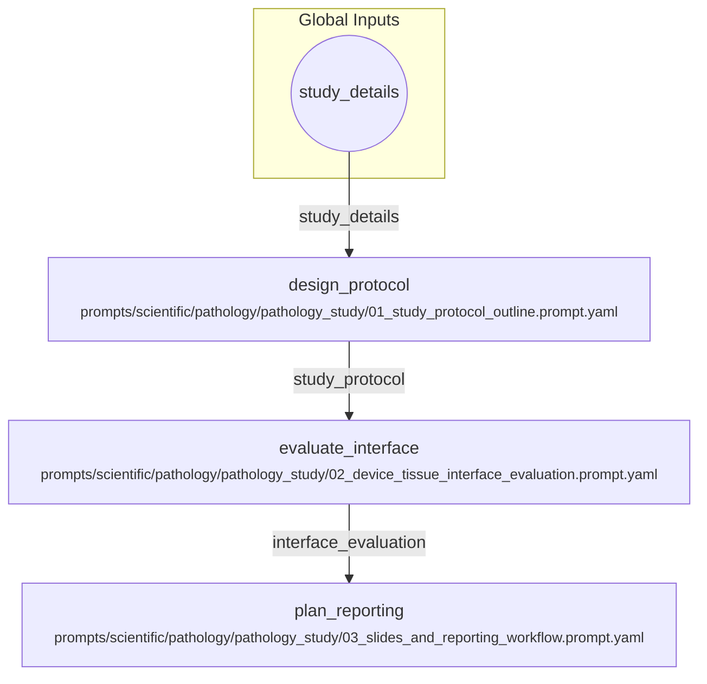

# Preclinical Pathology Study Workflow

A workflow to design a pathology study protocol, evaluate the device-tissue interface, and plan the slide reporting. This follows the sequence in the pathology_prompts directory.

## Visual Flow

