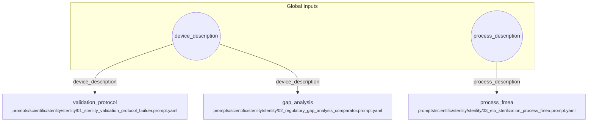

# Sterility Workflow

A workflow for building a sterility validation protocol, comparing regulatory gaps, and performing a process FMEA.

## Visual Flow

```mermaid
flowchart TD
    subgraph Inputs [Global Inputs]
        inp_device_description((device_description))
        inp_process_description((process_description))
    end
    validation_protocol["validation_protocol<br/><small>prompts/scientific/sterility/sterility/01_sterility_validation_protocol_builder.prompt.yaml</small>"]
    gap_analysis["gap_analysis<br/><small>prompts/scientific/sterility/sterility/02_regulatory_gap_analysis_comparator.prompt.yaml</small>"]
    process_fmea["process_fmea<br/><small>prompts/scientific/sterility/sterility/03_eto_sterilization_process_fmea.prompt.yaml</small>"]
    inp_device_description -->|device_description| validation_protocol
    inp_device_description -->|device_description| gap_analysis
    inp_process_description -->|process_description| process_fmea
```
