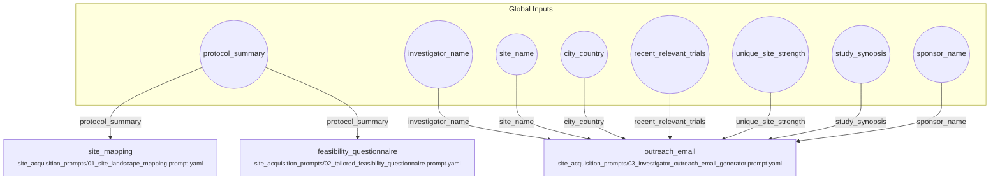

# Site Acquisition Workflow

A workflow for site landscape mapping, feasibility questionnaire building, and investigator outreach.

## Visual Flow

```mermaid
flowchart TD
    subgraph Inputs [Global Inputs]
        inp_protocol_summary((protocol_summary))
        inp_investigator_name((investigator_name))
        inp_site_name((site_name))
        inp_city_country((city_country))
        inp_recent_relevant_trials((recent_relevant_trials))
        inp_unique_site_strength((unique_site_strength))
        inp_study_synopsis((study_synopsis))
        inp_sponsor_name((sponsor_name))
    end
    site_mapping["site_mapping<br/><small>site_acquisition_prompts/01_site_landscape_mapping.prompt.yaml</small>"]
    feasibility_questionnaire["feasibility_questionnaire<br/><small>site_acquisition_prompts/02_tailored_feasibility_questionnaire.prompt.yaml</small>"]
    outreach_email["outreach_email<br/><small>site_acquisition_prompts/03_investigator_outreach_email_generator.prompt.yaml</small>"]
    inp_protocol_summary -->|protocol_summary| site_mapping
    inp_protocol_summary -->|protocol_summary| feasibility_questionnaire
    inp_investigator_name -->|investigator_name| outreach_email
    inp_site_name -->|site_name| outreach_email
    inp_city_country -->|city_country| outreach_email
    inp_recent_relevant_trials -->|recent_relevant_trials| outreach_email
    inp_unique_site_strength -->|unique_site_strength| outreach_email
    inp_study_synopsis -->|study_synopsis| outreach_email
    inp_sponsor_name -->|sponsor_name| outreach_email
```
