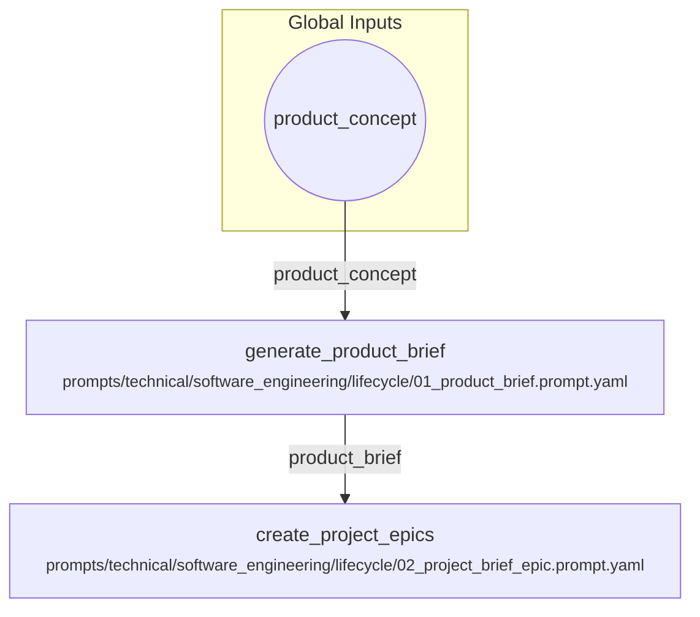

# Agentic Coding: From Idea to Epics

A workflow that takes a product concept, generates a product brief, and then creates project epics from that brief.

## Visual Flow

```mermaid
flowchart TD
    subgraph Inputs [Global Inputs]
        inp_product_concept((product_concept))
    end
    generate_product_brief["generate_product_brief<br/><small>prompts/technical/software_engineering/lifecycle/01_product_brief.prompt.yaml</small>"]
    create_project_epics["create_project_epics<br/><small>prompts/technical/software_engineering/lifecycle/02_project_brief_epic.prompt.yaml</small>"]
    inp_product_concept -->|product_concept| generate_product_brief
    generate_product_brief -->|product_brief| create_project_epics
```
