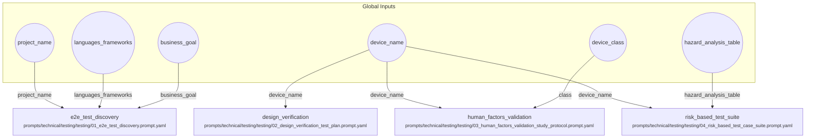

# Testing Workflow

A workflow for end-to-end test discovery, design verification, human factors validation, and risk-based test case suite generation.

## Visual Flow

```mermaid
flowchart TD
    subgraph Inputs [Global Inputs]
        inp_project_name((project_name))
        inp_languages_frameworks((languages_frameworks))
        inp_business_goal((business_goal))
        inp_device_name((device_name))
        inp_device_class((device_class))
        inp_hazard_analysis_table((hazard_analysis_table))
    end
    e2e_test_discovery["e2e_test_discovery<br/><small>prompts/technical/testing/testing/01_e2e_test_discovery.prompt.yaml</small>"]
    design_verification["design_verification<br/><small>prompts/technical/testing/testing/02_design_verification_test_plan.prompt.yaml</small>"]
    human_factors_validation["human_factors_validation<br/><small>prompts/technical/testing/testing/03_human_factors_validation_study_protocol.prompt.yaml</small>"]
    risk_based_test_suite["risk_based_test_suite<br/><small>prompts/technical/testing/testing/04_risk_based_test_case_suite.prompt.yaml</small>"]
    inp_project_name -->|project_name| e2e_test_discovery
    inp_languages_frameworks -->|languages_frameworks| e2e_test_discovery
    inp_business_goal -->|business_goal| e2e_test_discovery
    inp_device_name -->|device_name| design_verification
    inp_device_name -->|device_name| human_factors_validation
    inp_device_class -->|class| human_factors_validation
    inp_device_name -->|device_name| risk_based_test_suite
    inp_hazard_analysis_table -->|hazard_analysis_table| risk_based_test_suite
```
