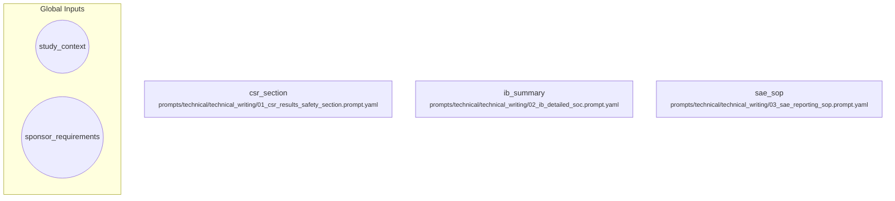

# Technical Writer Workflow

A workflow for drafting a CSR results and safety section, an Investigator's Brochure summary of changes, and an SAE reporting SOP.

## Visual Flow

```mermaid
flowchart TD
    subgraph Inputs [Global Inputs]
        inp_study_context((study_context))
        inp_sponsor_requirements((sponsor_requirements))
    end
    csr_section["csr_section<br/><small>prompts/technical/technical_writing/01_csr_results_safety_section.prompt.yaml</small>"]
    ib_summary["ib_summary<br/><small>prompts/technical/technical_writing/02_ib_detailed_soc.prompt.yaml</small>"]
    sae_sop["sae_sop<br/><small>prompts/technical/technical_writing/03_sae_reporting_sop.prompt.yaml</small>"]
```
